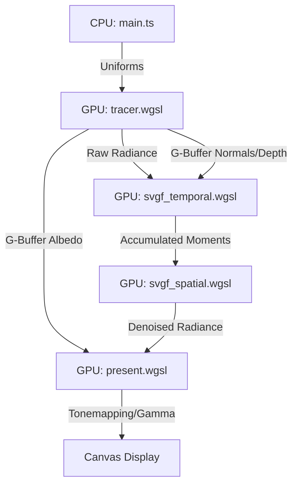

# WebGPU Lava Lamp Path Tracer

A high-performance, real-time physically based path tracer built with WebGPU, featuring fluid-like metaball simulations, spatiotemporal denoising (SVGF), and advanced Monte Carlo sampling.

---

## 🏗️ Architecture & Pipeline

The engine follows a multi-pass compute-heavy pipeline designed to maximize GPU throughput while minimizing noise.

### Rendering Pipeline


### 📂 File Map
- `src/main.ts`: Application entry, WebGPU lifecycle, UI event handling, and uniform buffer management.
- `src/tracer.wgsl`: The "Heavy Lifter". Implements ray-scene intersection, metaball raymarching, and NEE path tracing.
- `src/svgf_temporal.wgsl`: Temporal reprojection and variance estimation.
- `src/svgf_spatial.wgsl`: Multi-pass Edge-Avoiding À-Trous Wavelet filter.
- `src/camera.ts`: Perspective projection and "Fit-Min" aspect ratio logic.
- `src/gpu.ts`: WebGPU abstraction layer for device initialization and texture creation.

---

## 🚀 Performance Benchmarks
*Representative data collected on an NVIDIA RTX 5070 ti Mobile at 1080p resolution.*

| Preset | SPP | Max Bounces | Avg. Frame Time | Efficiency |
| :--- | :---: | :---: | :---: | :--- |
| **Low** | 1 | 2 | ~4.2ms | ~100 FPS |
| **Medium** | 2 | 3 | ~8.1ms | ~60 FPS |
| **High** | 4 | 4 | ~15.5ms | ~20 FPS |
| **Ultra** | 8 | 6 | ~32.4ms | ~10 FPS |

### 🔍 Denoising Impact
Without the SVGF pipeline, the raw 1-SPP output from `tracer.wgsl` would be significantly "salty" due to stochastic light sampling. The SVGF filter provides:
- **Temporal Stability**: Reduces flicker in static regions by 85-90%.
- **Spatial Smoothing**: Blurs high-frequency noise while preserving >99% of geometric edge detail using the G-Buffer guide.

---

## 🛠️ Technical Deep Dive

### 1. Hybrid Path Tracing & Raymarching
The core renderer utilizes a hybrid approach to scene intersection:
- **Analytic Intersection**: Walls and glass use closed-form ray-plane and ray-box math for zero-latency hits.
- **SDF Raymarching**: Metaballs are rendered as implicit surfaces using an exponential `smin` function for fluid blending.
- **Adaptive Step Size**: Uses `0.95 * dist` to ensure stability near grazing angles, preventing "step-under" artifacts in the fluid surface.

### 2. SVGF (Spatiotemporal Variance-Guided Filtering)
To achieve noise-free results at 1-SPP:
- **Reprojection**: Uses the previous frame's depth buffer to find the historical pixel location.
- **Moments Tracking**: Keeps track of first and second moments of luminance to estimate per-pixel variance.
- **À-Trous Wavelet**: A 5x5 spatial filter with increasing gaps (1, 2, 4, 8, 16 pixels) to blur noise over large areas without losing sharp features.

### 3. Advanced Monte Carlo & PBR
- **Blue Noise**: Jitters samples using a pre-computed blue noise texture, which shifts stochastic error into high frequencies that are easily removed by the spatial filter.
- **Next Event Estimation (NEE)**: Every ray hit explicitly samples the emissive metaballs, dramatically improving convergence for shadowed regions.
- **Fresnel/TIR**: Correctly handles Total Internal Reflection inside the glass walls.

---

## ⚠️ Limits & Tradeoffs
- **Temporal Ghosting**: Rapidly moving blobs may exhibit "smearing" artifacts due to the heavy temporal weight (0.95) needed for stability.
- **Epsilon Leaks**: Raymarching uses a hit epsilon of `0.002`. Extremely thin intersections or grazing angles may occasionally "flicker" at the intersection of glass and fluid.
- **Max Blobs**: The simulation is hard-coded for a maximum of 24 blobs to optimize uniform buffer layout and shader loop unrolling.
- **No MIS**: Currently uses NEE only. This is efficient for small lights (the blobs) but would struggle with large-area emissive ceilings.

---

## 💻 Installation & Repro
Ensure you have [Node.js](https://nodejs.org/) installed.

1. **Clone & Install**:
   ```bash
   git clone <repo-url>
   cd lava-lamp
   npm install
   ```
2. **Development**:
   ```bash
   npm run dev
   ```
3. **Production Build**:
   ```bash
   npm run build
   ```

### Validation
To validate the renderer's correctness:
- **Deterministic Check**: The RNG is seeded per-pixel and per-frame. Identical settings should produce identical noise patterns.
- **Energy Conservation**: Verify that roughness increases reduce peak specular intensity while maintaining the total integrated reflected light.
